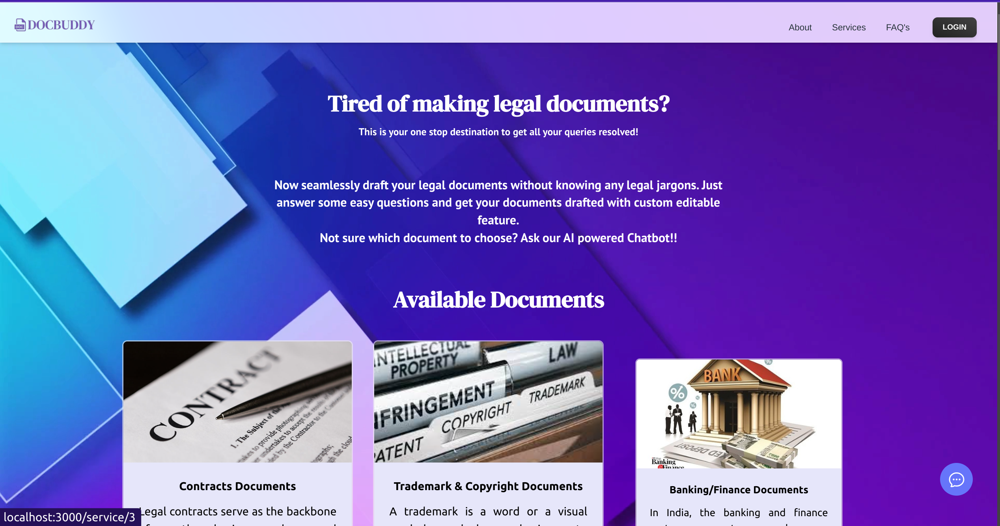
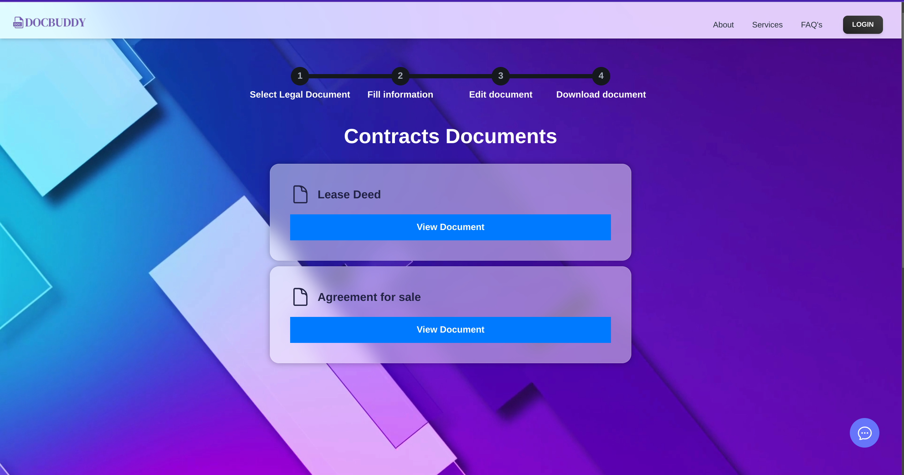
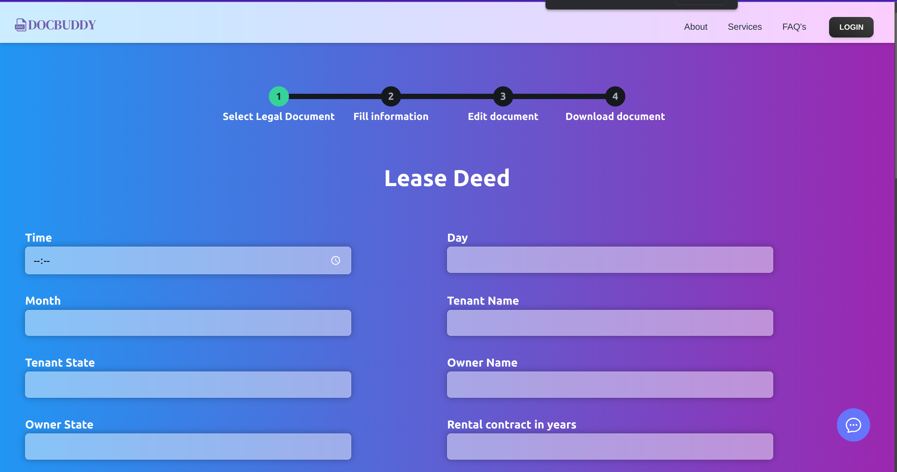
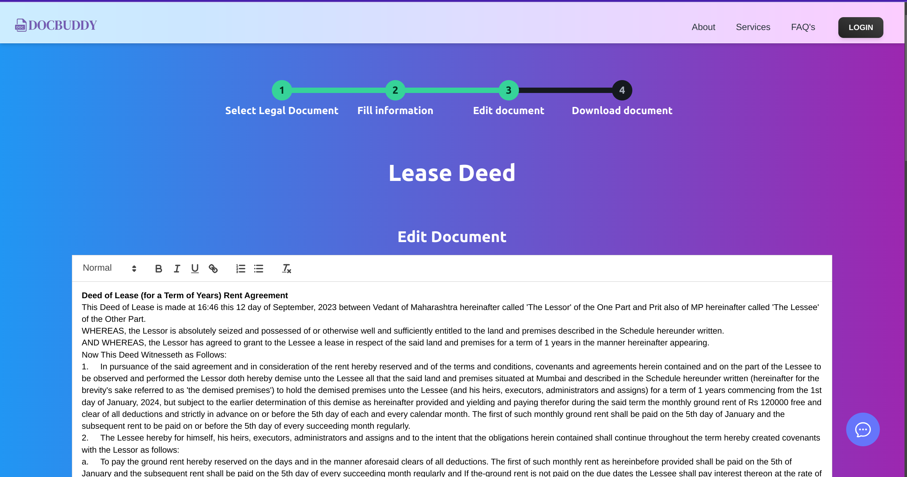
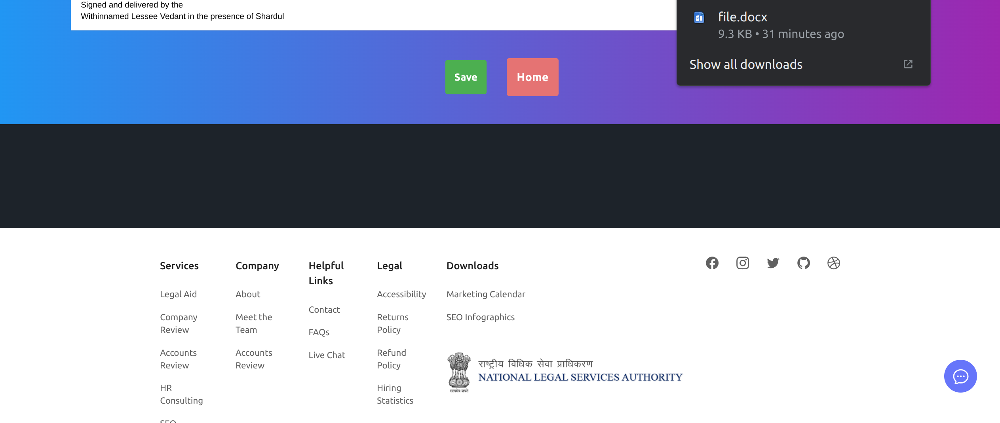
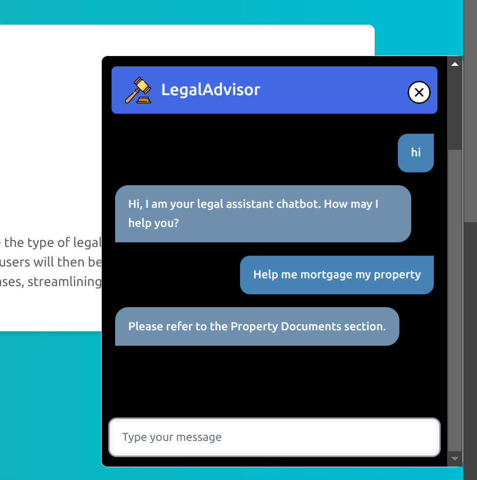
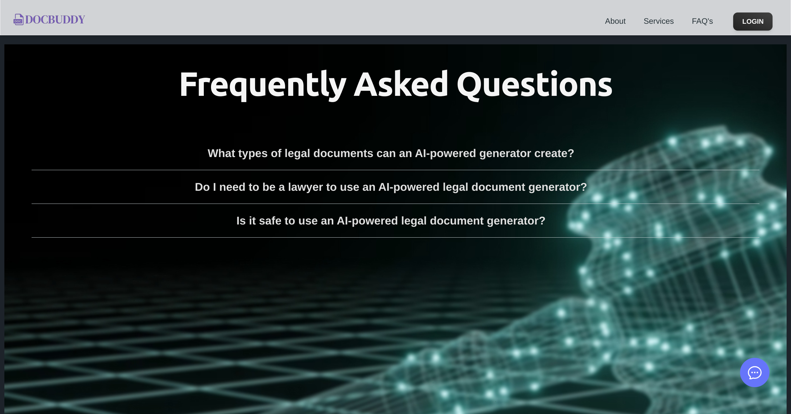
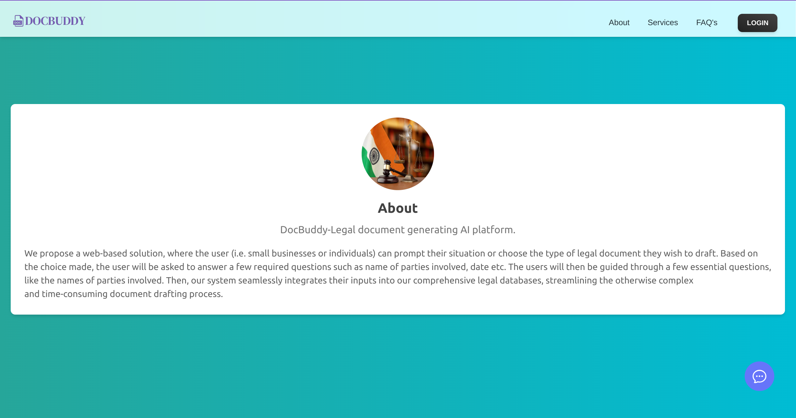

# Legal-Documentation-Assistant

## Table of Contents

- [Project](#legal-documentation-assistant)
  - [Table of Contents](#table-of-contents)
  - [About The Project](#about-the-project)
  - [Demo](#demo)
  - [Tech Stack](#tech-stack)
  - [File Structure](#file-structure)
  - [Getting started](#getting-started)
  - [Screenshots of Website](#screenshots-of-the-website)
  - [Contributors](#contributors)
  - [License](#license)

## About The Project

Legal documentation can be a complicated and time-consuming process, especially for individuals and small businesses who may not have access to legal resources. In addition, the language and jargon used in legal documents can be difficult for non-lawyers to understand, which can lead to errors and misunderstandings. 

**Objective**: The objective of this project is to develop an AI-powered solution that can simplify legal documentation for individuals and small businesses in India, by automatically drafting legal documents in plain language and using easy-to-understand terms. 

**Features**: 

1. User-friendly interface to input relevant information such as parties involved, terms of the agreement, and other necessary details. 

2. AI-powered document generation that automatically recommends legal documents based on user query. 

3. Ability to customize legal documents based on the specific needs of the user. 

4. Integration with existing legal resources and databases to ensure accuracy and completeness of the legal documents. 

**Impact**: The proposed solution can greatly benefit individuals and small businesses in India, who often face challenges with legal documentation due to limited access to legal resources. By simplifying legal documentation, this solution can potentially save time, reduce errors, and increase access to justice. 

**Data**: We have made use of [LawRato](https://lawrato.com/legal-documents) for the dataset of legal documents.

## Demo

https://github.com/PritK99/Legal-Documentation-Assistant/assets/103848930/023f19a9-dea2-458b-ae53-6f6c7f36d74f

## Tech Stack

- 

- 

- 

- 

- 

## File Structure
```
👨‍💻Legal-Documentation-Assistant
 ┣ 📂assets                            // Contains all the reference gifs, images
 ┣ 📂client                            // Frontend        
 ┃ ┣ 📂src                                      
 ┃ ┃ ┣ 📂components  
 ┃ ┃ ┃ ┣ 📄Chat.jsx
 ┃ ┃ ┣ 📄about.jsx
 ┃ ┃ ┣ 📄Faq.jsx
 ┃ ┃ ┣ 📄Home.jsx
 ┃ ┃ ┣ 📄InputForm.jsx
 ┃ ┃ ┣ 📄LoginPage.jsx
 ┃ ┣ 📂public 
 ┃ ┃ ┣ 📄index.html
 ┣ 📂model                             // Standalone model         
 ┃ ┣ 📄similarity.py                   // Based on Cosine Similarity
 ┃ ┣ 📄bot.py    
 ┃ ┣ 📄chat.py                         // To chat with the standalone model
 ┃ ┣ 📄model.py                        // Based on Bag of Words
 ┃ ┣ 📄train.py                        
 ┃ ┣ 📄dataset.py 
 ┃ ┣ 📄util.py   
 ┃ ┣ 📄trained_model.pth
 ┃ ┣ 📄intents.json                    // Dataset 
 ┣ 📂server                            // Backend 
 ┃ ┣ 📂docs  
 ┃ ┃ ┣ 📄localfile.docx
 ┃ ┃ ┣ 📄Output2.docx
 ┃ ┣ 📄app.py 
 ┃ ┣ 📄createdatabase.py  
 ┃ ┣ 📄requirements.txt      
 ┣ 📄README.md
``` 

## Getting Started

### Installation

Clone the project by typing the following command in your Terminal/CommandPrompt

```
git clone https://github.com/PritK99/Legal-Documentation-Assistant.git
```
Navigate to the Legal Documentation Assistant folder

```
cd Legal-Documentation-Assistant
```

#### Frontend

Open a new terminal in root folder and navigate to the client folder

```
cd client/
```

Install all the required dependencies

```
npm i
```

To run the frontend

```
npm start
```

Once the above command is executed, the frontend will be running at ```localhost:3000```. You can visit http://localhost:3000/ to view the website.

#### Backend

Open a new terminal in root folder and navigate to the server folder 

```
cd server
```

Create a virtual environment to install all the dependencies

```
python -m venv docbuddy
```

Activate the virtual environment

For Windows: ```docbuddy\Scripts\activate```

For Linux: ```source docbuddy/bin/activate```

Install all the required dependencies

```
pip install -r requirements.txt
```

To create a database on render and creating a environment file, follow the given steps

1. Visit the [website](https://render.com/) and create an account or sign in. 
2. Next, choose a new service as PostgreSQL to create a new database service. 
3. Give an appropriate name to the database and the instance name.
4. Select <b>Free</b> option in the Instance type and hit <b>Create Database</b> button at the bottom.

A new empty PostgreSQL database service will then be created. You can view all the services on your Render Dashboard.
> **Note** <br>
> The PostgreSQL database service will remain free on render only upto 3 months.


Next, create a .env file containing the credentials of your database. Sample .env file looks like:
```
DATABASE_HOST=your_database_host
DATABASE_NAME=your_database_name
DATABASE_USER=your_database_username
PASSWORD=your_database_password
DATABASE_PORT=your_database_port
```

> **Note** <br>
> ```DATABASE_HOST``` in ```.env``` should be of form ```<Hostname>.<region>-postgres.render.com```. For example, if the region of database is ```Oregon (US West)```, then hostname can be ```<Hostname>.oregon-postgres.render.com```
  

You can get all this database credentials by visiting the PostgreSQL database service you created on your render dashboard.

Once the .env file is setup, next run the createdatabase.py script using the following command in the terminal:
```
python server/createdatabase.py  
```

Running the createdatabase.py script will create the entire database for you.

> **Note** <br>
> If you want to create the PostgreSQL database on your local device instead of hosting on render, you are free to do so. But, you need to change the .env file accordingly.

To run the backend

```
python app.py
```

## Screenshots of the Website

- #### Home Page

    

- #### Documents Page

    

- #### Dynamic form page (generated for the specific legal document)

    

- #### Document Editor 

    

- #### Downloading the document

    

- #### Chatbot 

    

- #### FAQ page

    

- #### About Page

    

## Contributors
- [Devayani Chandane](https://github.com/devayani03)
- [Kavan Gandhi](https://github.com/KGan31)
- [Mihir Rathod](https://github.com/m-g-rathod)
- [Prit Kanadiya](https://github.com/PritK99)
- [Shardul Khade](https://github.com/shark-21)
- [Vedant Nimje](https://github.com/vrnimje)

## References
- [LawRato](https://lawrato.com/legal-documents) for the dataset of legal documents.

## License
[MIT License](https://opensource.org/licenses/MIT)
