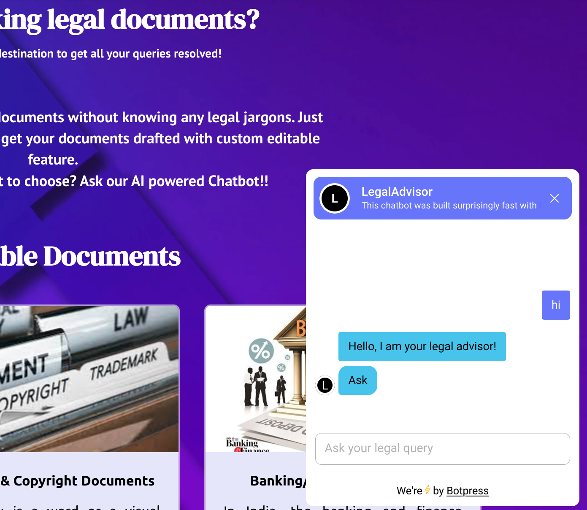

# Legal-Documentation-Assistant
## Problem Statement

Legal documentation can be a complicated and time-consuming process, especially for individuals and small businesses who may not have access to legal resources. In addition, the language and jargon used in legal documents can be difficult for non-lawyers to understand, which can lead to errors and misunderstandings. 

**Objective**: The objective of this hackathon challenge is to develop an AI-powered solution that can simplify legal documentation for individuals and small businesses in India, by automatically drafting legal documents in plain language and using easy-to-understand terms. 

**Potential Features**: 

1. User-friendly interface for inputting relevant information such as parties involved, terms of the agreement, and other necessary details. 

2. AI-powered document generation that automatically drafts legal documents in plain language and using easy-to-understand terms. 

3. Ability to customize legal documents based on the specific needs of the user. 

4. Integration with existing legal resources and databases to ensure accuracy and completeness of the legal documents. 

5. Option for users to seek legal advice from an expert in case of complex legal issues. 

**Impact**: The proposed solution can greatly benefit individuals and small businesses in India, who often face challenges with legal documentation due to limited access to legal resources. By simplifying legal documentation, this solution can potentially save time, reduce errors, and increase access to justice. 

**Data**: Participants can use publicly available legal databases and resources to train the AI model for document generation. 

**Deliverables**: 

1. A working prototype of the AI-powered legal documentation assistant, demonstrating its functionality and ease of use. 

2. A presentation outlining the features and potential impact of the solution, as well as its technical architecture and data requirements. 

3. Code and documentation for the solution, along with instructions for deployment and maintenance. 

## Tech stack used

- 

- 

- 

- 

- 

## Setup

- First, clone the repository into your system, and enter the repository in your terminal

```
git clone https://github.com/PritK99/Legal-Documentation-Assistant.git
cd Legal-Documentation-Assistant/
```

- To start the client, run these commands

```
cd client/src/

npm i

npm run start
```

- To start the server, run these commands on a new terminal, at folder `Legal-Documentation-Server/`
```
cd server/

pip install flask cors python-docx requests MySQLdb mammoth

python3 app.py
```

## Screenshots of the Webpage

- #### Home Page

    

- #### Documents Page

    

- #### Dynamic form page (generated for the specific legal document)

    

- #### Document Editor 

    

- #### Downloading the document

    

- #### Chatbot 

    

- #### FAQ page

    

- #### About Page

    

## Contributors

- [Shardul Khade](https://github.com/shark-21)
- [Mihir Rathod](https://github.com/m-g-rathod)
- [Prit Kanadiya](https://github.com/PritK99)
- [Devayani Chandane](https://github.com/devayani03)
- [Kavan Gandhi](https://github.com/KGan31)
- [Vedant Nimje](https://github.com/vrnimje)

## References

- [LawRato](https://lawrato.com/legal-documents), for the dataset of legal documents
- [Botpress](https://botpress.com/), for building the AI-powered chatbot


